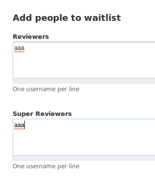
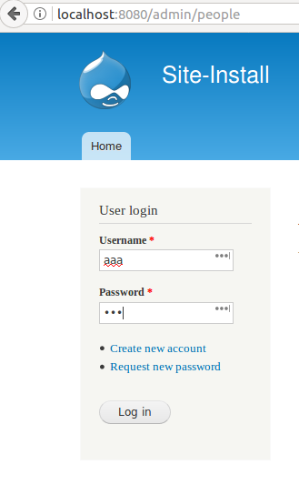
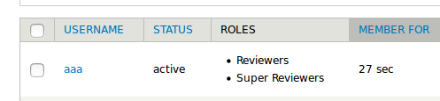

User Waitlist
=============
What
-
A Wait List that will insert a user into predefined roles upon account creation. Good to use in situations where modules handling SSO or LDAP will initially create an account. Upon account creation, roles will be automatically added to the user. 

Why
-
I have a situation where a client uses a centralized management system for logins (OpenAM).  They heavily use roles in their applications and need users immediately added to Roles on their first login. 

How
-
An individual with permission, adds user names to a wait list. Drupal then watches for when these names first login (typically after LDAP or OpenAM creates the account). Once the user is added to those Roles, the wait list entry is removed. 

Where
-
To see what's going on, look at the database table `waitlist` and tail watchdog `drush wd-show --tail`.


How to use
=
Install and activate the module. First go to the administration page as such.



Go about creating the user. In some cases your OpenAM or LDAP module may do this for you based off your central 
identity management infrastructure. 

For my own testing on localhost, I manually created a user through drush via

```
$ drush ucrt aaa --password=aaa
```

Then log in as that new user:




Return to the browser in which you've logged in as an administrator:



To following along the process, tail the WatchDog log:

``` 
 488  15/Mar 16:50  notice  waitlist  Inserted aaa queued for Reviewers                                  
 489  15/Mar 16:50  notice  waitlist  Inserted aaa queued for Super Reviewers                            
 490  15/Mar 16:50  notice  user      Session opened for aaa.                                            
 491  15/Mar 16:50  notice  waitlist  aaa                                                                
 492  15/Mar 16:50  notice  waitlist  aaa is wait-listed to Reviewers, Super Reviewers                   
 493  15/Mar 16:50  notice  waitlist  Request for aaa was removed. Those roles were Reviewers, Super     
                                      Reviewers                                                          


```
